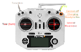

# TSC Robot Code
This is the code running on the robot.

## Hardware
Currently targeting the Arduino platform. Receiver is [FrSky XM PLUS](https://www.frsky-rc.com/product/xm-plus/). It takes enough current it must be powered through 5V and GND on the Arduino, _not_ data pins. It uses [SBUS](https://github.com/bolderflight/SBUS) to communicate.

### Pins
They are defined in [tsc-robot.h](./tsc-robot.h) for Arduino Mega 2560. Other boards with throw a preprocessor error.

## Program Architecture
`setup()` is straightforward.

The `loop()` is designed to return to the top of the loop at a high frequency. The functions of the robot are divided into states, each with its own `case`.

We want to be able to process incoming commands very quickly (>60Hz), so each `case` should be non-blocking and break very soon. This means they need to be resumable, and store their state outside the `loop()` scope. This enables us to cancel a pressure charge in-progress (safety!).

The exception to this fast-`case` rule is the firing state, where there is never going to be anything else to do besides rapidly discharging the pressure via the muzzle.

## To do:
 - [x] Design a program architecture
 - [x] Receive SBUS packets from the R/C hardware
 - [ ] User documentation
 - [ ] Implement total arm switch to disable all controls
 - [ ] Implement Mecanum drive to convert from 2-axis move stick and 1-axis yaw to omnidirectional movement
 - [ ] Verify with oscilloscope and `DEBUG_OSCILLO` _without_ `DEBUG_SERIAL` speed of input polling
 - [ ] Verify good code (review, tests?)
 - [ ] Install the Arduino into the robot
 - [ ] Buy more CO2

## Controls

## Dev Docs

Servo reaction to PWM:  
| PWM \[0-255] | Movement       |
| ------------ | -------------- |
| 0            | Stop           |
| 70           | Full reverse   |
| 127          | Slower reverse |
| 185          | Stop           |
| 195          | Slow forwards  |
| 254          | Full forwards  |
